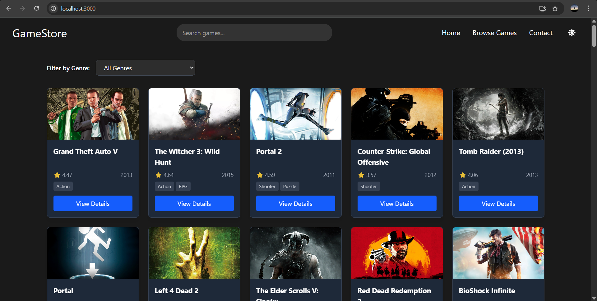

# 🎮 GameStore - Modern Game Discovery Platform



A modern, responsive game discovery platform built with React and powered by the RAWG Video Games Database API. Browse, search, and discover your next favorite game with an intuitive interface that works beautifully on all devices.

## ✨ Features

- 🎮 Browse a vast collection of games
- 🔍 Search functionality with live results
- 🏷️ Filter games by genre
- 🌓 Light/Dark mode toggle
- 📱 Fully responsive design
- ⚡ Fast and performant
- 🎨 Modern UI with smooth animations
- 📱 Mobile-first approach

## 🚀 Technologies Used

- ⚛️ React 18
- 🎨 Tailwind CSS for styling
- 🔄 React Router for navigation
- 🔍 Axios for API requests
- 🌓 Dark mode support
- 📱 Responsive design with mobile-first approach
- 🚀 Lazy loading for better performance

## 🛠️ Installation

1. Clone the repository:
   ```bash
   git clone https://github.com/oldstone7/gamestore.git
   cd gamestore
   ```

2. Install dependencies:
   ```bash
   npm install
   ```

3. Create a `.env` file in the root directory and add your RAWG API key (you can get one for free from [RAWG](https://rawg.io/apidocs)):
   ```
   REACT_APP_RAWG_API_KEY=your_api_key_here
   ```

4. Start the development server:
   ```bash
   npm start
   ```

5. Open [http://localhost:3000](http://localhost:3000) to view it in your browser.

## 🎨 Project Structure

```
src/
├── components/           # Reusable components
│   ├── GameCard.jsx      # Game card component
│   ├── GameDetails.jsx   # Game details page
│   ├── GameList.jsx      # Game listing page
│   ├── Navbar.jsx        # Navigation bar
│   ├── Footer.jsx        # Footer component
│   └── Contact.jsx       # Contact page
├── App.js               # Main application component
└── index.js             # Application entry point
```

## 🌐 API Usage

This project uses the [RAWG Video Games Database API](https://rawg.io/apidocs) to fetch game data. You'll need to sign up for a free API key from their website.

## 🎯 Features in Development

- [ ] User authentication
- [ ] Game wishlisting
- [ ] User reviews and ratings
- [ ] Advanced filtering and sorting
- [ ] Game trailers and screenshots gallery


## 👨‍💻 Author

- **Sulaiman Alfareeth** - [GitHub](https://github.com/oldstone7) | [Portfolio](https://sulaimanalfareeth.vercel.app)

## 🙏 Acknowledgments

- [RAWG Video Games Database API](https://rawg.io/apidocs) for the game data
- [Create React App](https://create-react-app.dev/) for the project setup
- [Tailwind CSS](https://tailwindcss.com/) for the utility-first CSS framework
- [Lucide Icons](https://lucide.dev/) for the beautiful icons

## 🤝 Contributing

Contributions are always welcome! Please feel free to submit a Pull Request.

## 📬 Contact

Have questions or want to get in touch? Feel free to reach out at [sulaimanalfareeth@gmail.com](mailto:sulaimanalfareeth@gmail.com) or through my [portfolio website](https://sulaimanalfareeth.vercel.app).
